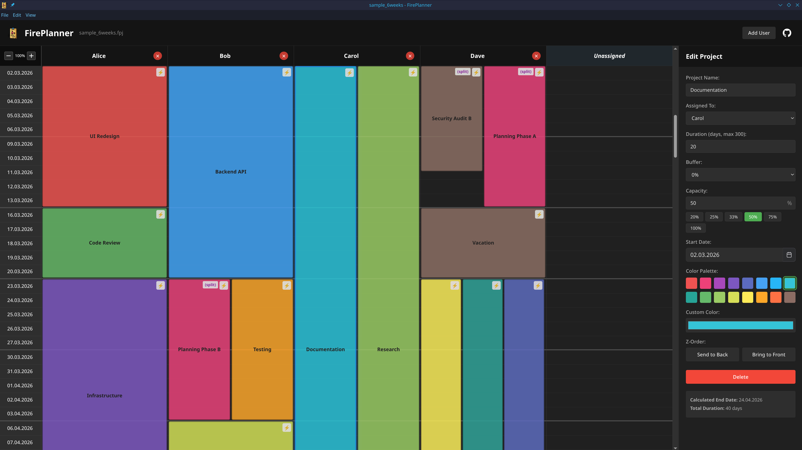

# FirePlanner

A visual project planning desktop application that helps teams organize and track projects across user timelines. Built with Electron, Vite, and Vue 3 + TypeScript.

FirePlanner displays projects as colored blocks in a grid where each column represents a team member and each row represents a weekday. This makes it easy to see who's working on what and when projects overlap.



## Quick Start

After cloning the repository:

```bash
# Install dependencies
npm install

# Start the application in development mode (Windows, Linux, macOS)
npm run dev:electron
```

The application will launch with DevTools open. Your planning data is automatically saved in your system's user data directory.

## Configuration

FirePlanner can be configured by editing the `config.json` file located in your user data directory:

- **Linux**: `~/.config/fireplanner/config.json`
- **Windows**: `%APPDATA%\fireplanner\config.json`
- **macOS**: `~/Library/Application Support/fireplanner/config.json`

The bundled `config.json` in the project root serves as the default configuration. User-specific settings override these defaults.

### Configuration Options

```json
{
  "autosave": {
    "enabled": true,
    "intervalSeconds": 30,
    "folder": ""
  },
  "workingDays": [1, 2, 3, 4, 5],
  "customProperties": []
}
```

#### Autosave Settings

- **`enabled`** (boolean): Enable/disable automatic saving. Default: `true`
- **`intervalSeconds`** (number): How often to autosave (in seconds). Default: `30`
- **`folder`** (string): Custom autosave directory path. Leave empty (`""`) to use default location in user data directory

#### Working Days

- **`workingDays`** (array of numbers): Days of the week to display in the grid
  - `1` = Monday, `2` = Tuesday, `3` = Wednesday, `4` = Thursday, `5` = Friday, `6` = Saturday, `7` = Sunday
  - Default: `[1, 2, 3, 4, 5]` (Monday-Friday)
  - Example for 6-day week: `[1, 2, 3, 4, 5, 6]`
  - Example for 7-day week: `[1, 2, 3, 4, 5, 6, 7]`

#### Custom Properties

Define additional metadata fields for your projects. Each property definition has:

- **`name`** (string): Display name of the property
- **`type`** (string): Data type - `"string"`, `"number"`, `"float"`, `"boolean"`, or `"Date"`
- **`required`** (boolean): Whether the field must be filled when creating projects

**Example:**
```json
{
  "customProperties": [
    {
      "name": "OrderNumber",
      "type": "string",
      "required": true
    },
    {
      "name": "Priority",
      "type": "number",
      "required": false
    },
    {
      "name": "Deadline",
      "type": "Date",
      "required": false
    },
    {
      "name": "IsUrgent",
      "type": "boolean",
      "required": false
    }
  ]
}
```

Custom properties appear as collapsible fields in the project editor panel.

**Note:** After modifying `config.json`, restart the application or use File → Reload Config for changes to take effect.

### Sample Project

A sample project file (`sample_6weeks.fpj`) is included that demonstrates:
- Four users with various project assignments
- Project lanes (parallel projects with different capacities)
- Split projects (collaborative and sequential)
- Different durations, buffers, and capacity settings
- 6-week timeline spanning March-April 2026

Open it via **File → Open** to explore all features.

## Features

- **Visual Timeline Grid**: Users as columns, weekdays as rows (configurable working days)
- **Project Lanes**: Multiple parallel projects per user with automatic lane assignment based on capacity
- **Split Projects**: Divide projects across team members or time periods with synchronized properties
- **Capacity Management**: Set project capacity (25%, 33%, 50%, 75%, 100%) to show partial availability
- **Buffer & Duration**: Add time buffers and set working day durations with half-day precision
- **Color-Coded Projects**: Assign custom colors to projects for easy identification
- **Quick Editing**: Double-click projects or grid cells to create/edit
- **User Management**: Add, rename, and remove team members
- **Copy/Paste**: Duplicate projects with Ctrl+C, Ctrl+X, Ctrl+V
- **Zoom Controls**: Scale the grid from 50% to 250% (Ctrl +/-)
- **Z-Order Management**: Control visual stacking of overlapping projects
- **Undo/Redo**: Full history support for all changes
- **File Management**: Save, Save As, Open, and Recent Files support
- **Custom Properties**: Define additional metadata fields for projects (configurable)
- **Auto-Save**: Changes are automatically persisted to disk
- **Dark Mode**: Toggle between light and dark themes (Ctrl+D)

## Development

```bash
# Install dependencies
npm install

# Start the Electron app (cross-platform)
npm run dev:electron

# Or on Linux/macOS with auto-cleanup of stale Vite processes
npm run electron:dev
```

Both Vite and Electron run together. Changes to Vue components will hot-reload automatically.

## Testing

Run the comprehensive test suite:

```bash
# Run tests in watch mode
npm test

# Run tests once
npm run test:run

# Run tests with UI
npm run test:ui

# Run tests with coverage report
npm run test:coverage
```

**Test Coverage:**
- Comprehensive test suite covering utilities, stores, and components
- Date utilities (weekday calculations, working day filtering, formatting)
- Project utilities (duration calculation with buffer/capacity, project lane assignment)
- Pinia store (CRUD operations, user management, split projects, undo/redo)
- Vue components (rendering, interactions, drag & drop, project blocks)

## Usage

### Managing Users
- **Add User**: Click the "Add User" button in the header
- **Rename User**: Double-click a user column header
- **Delete User**: Click the × button on a user column (projects move to "Unassigned")

### Managing Projects
- **Create**: Click "New Project" button or double-click any grid cell
- **Edit**: Double-click any project block
- **Delete**: Select a project and press Delete or Backspace
- **Copy/Cut/Paste**: Use Ctrl+C, Ctrl+X, Ctrl+V to duplicate projects
- **Split Project**: Click the ⚡ button on a project to divide it across users or time periods
- **z-Order**: Use "Send to Back" / "Bring to Front" buttons to control overlapping project stacking

### Project Properties
- **Duration**: Set project duration in working days (supports 0.5 increments)
- **Buffer**: Add time buffer (0-100%) to account for uncertainty
- **Capacity**: Set daily capacity (e.g., 50% for half-time, 33% for three parallel projects)
- **Custom Properties**: Additional metadata fields (configurable in config.json)

### Split Projects
When you split a project:
- Shared properties sync across all splits: name, color, custom properties
- Independent per split: user assignment, start date, duration, buffer, capacity
- Purple border highlights all related splits when one is selected
- Duration summary shows if splits don't match the planned overall duration

### Keyboard Shortcuts
- `Ctrl + N` — New plan
- `Ctrl + O` — Open file
- `Ctrl + S` — Save
- `Ctrl + Shift + S` — Save As
- `Ctrl + C` — Copy selected project
- `Ctrl + X` — Cut selected project  
- `Ctrl + V` — Paste project
- `Delete` / `Backspace` — Delete selected project
- `Ctrl + +` — Zoom in
- `Ctrl + -` — Zoom out
- `Ctrl + 0` — Reset zoom
- `Ctrl + Z` — Undo
- `Ctrl + Y` — Redo
- `Ctrl + D` — Toggle dark mode

## Tech Stack

- **[Electron](https://www.electronjs.org/)** — Desktop application framework
- **[Vue 3](https://vuejs.org/)** — Progressive JavaScript framework with Composition API
- **[Vite](https://vitejs.dev/)** — Fast build tool and dev server
- **[TypeScript](https://www.typescriptlang.org/)** — Type-safe JavaScript
- **[Pinia](https://pinia.vuejs.org/)** — State management with undo/redo support
- **[PrimeVue](https://primevue.org/)** — UI component library
- **[Vitest](https://vitest.dev/)** — Unit testing framework
- **[Vue Test Utils](https://test-utils.vuejs.org/)** — Vue component testing

## Building for Production

```bash
# Build the application for your current platform
npm run build

# Or build for specific platforms
npm run build:linux    # Build Linux AppImage
npm run build:win      # Build Windows installer (NSIS)
```

Distributables will be created in the `release/` directory:
- **Linux**: AppImage (FirePlanner-x.x.x.AppImage)
- **Windows**: NSIS installer (FirePlanner-Setup-x.x.x.exe)
- **macOS**: DMG (requires macOS to build)

### Automated Releases

The project includes a GitHub Actions workflow that automatically builds Linux and Windows releases when you push a version tag:

```bash
# Create and push a version tag
git tag v0.3.0
git push origin v0.3.0
```

The workflow will:
1. Build Linux AppImage on Ubuntu
2. Build Windows installer on Windows
3. Create a GitHub release with both artifacts attached

You can also manually trigger the build from the Actions tab in GitHub.

## License

MIT
