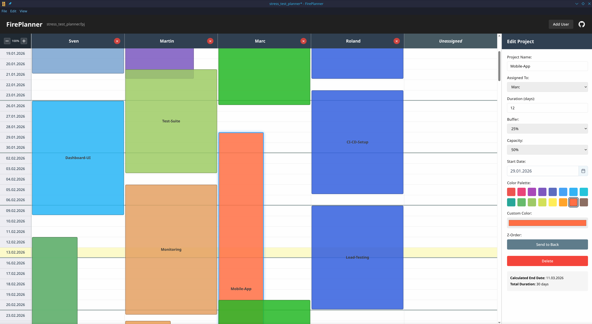

# FirePlanner

A visual project planning desktop application that helps teams organize and track projects across user timelines. Built with Electron, Vite, and Vue 3 + TypeScript.

FirePlanner displays projects as colored blocks in a grid where each column represents a team member and each row represents a weekday. This makes it easy to see who's working on what and when projects overlap.



## Quick Start

After cloning the repository:

```bash
# Install dependencies
npm install

# Start the application in development mode (Windows, Linux, macOS)
npm run dev:electron
```

The application will launch with DevTools open. Your planning data is automatically saved in your system's user data directory.

## Features

- **Visual Timeline Grid**: Users as columns, weekdays as rows (Monday-Friday)
- **Color-Coded Projects**: Assign custom colors to projects for easy identification
- **Quick Editing**: Double-click projects or grid cells to create/edit
- **User Management**: Add, rename, and remove team members
- **Copy/Paste**: Duplicate projects with Ctrl+C, Ctrl+X, Ctrl+V
- **Zoom Controls**: Scale the grid from 50% to 250% (Ctrl +/-)
- **Undo/Redo**: Full history support for all changes
- **Auto-Save**: Changes are automatically persisted to disk

## Development

```bash
# Install dependencies
npm install

# Start the Electron app (cross-platform)
npm run dev:electron

# Or on Linux/macOS with auto-cleanup of stale Vite processes
npm run electron:dev
```

Both Vite and Electron run together. Changes to Vue components will hot-reload automatically.

## Testing

Run the comprehensive test suite:

```bash
# Run tests in watch mode
npm test

# Run tests once
npm run test:run

# Run tests with UI
npm run test:ui

# Run tests with coverage report
npm run test:coverage
```

**Test Coverage:**
- 73 tests across utilities, stores, and components
- Date utilities (weekday calculations, formatting)
- Project utilities (duration with buffer/capacity)
- Pinia store (CRUD operations, user management)
- Vue components (rendering, interactions, drag & drop)

## Usage

### Managing Users
- **Add User**: Click the "Add User" button in the header
- **Rename User**: Double-click a user column header
- **Delete User**: Click the × button on a user column (projects move to "Unassigned")

### Managing Projects
- **Create**: Click "New Project" button or double-click any grid cell
- **Edit**: Double-click any project block
- **Delete**: Select a project and press Delete or Backspace
- **Copy/Cut/Paste**: Use Ctrl+C, Ctrl+X, Ctrl+V to duplicate projects

### Keyboard Shortcuts
- `Ctrl + C` — Copy selected project
- `Ctrl + X` — Cut selected project  
- `Ctrl + V` — Paste project
- `Delete` / `Backspace` — Delete selected project
- `Ctrl + +` — Zoom in
- `Ctrl + -` — Zoom out
- `Ctrl + 0` — Reset zoom
- `Ctrl + Z` — Undo
- `Ctrl + Y` — Redo

## Tech Stack

- **[Electron](https://www.electronjs.org/)** — Desktop application framework
- **[Vue 3](https://vuejs.org/)** — Progressive JavaScript framework with Composition API
- **[Vite](https://vitejs.dev/)** — Fast build tool and dev server
- **[TypeScript](https://www.typescriptlang.org/)** — Type-safe JavaScript
- **[Pinia](https://pinia.vuejs.org/)** — State management with undo/redo support
- **[PrimeVue](https://primevue.org/)** — UI component library
- **[Vitest](https://vitest.dev/)** — Unit testing framework
- **[Vue Test Utils](https://test-utils.vuejs.org/)** — Vue component testing

## Building for Production

```bash
# Build the application for your current platform
npm run build

# Or build for specific platforms
npm run build:linux    # Build Linux AppImage
npm run build:win      # Build Windows installer (NSIS)
```

Distributables will be created in the `release/` directory:
- **Linux**: AppImage (FirePlanner-x.x.x.AppImage)
- **Windows**: NSIS installer (FirePlanner-Setup-x.x.x.exe)
- **macOS**: DMG (requires macOS to build)

### Automated Releases

The project includes a GitHub Actions workflow that automatically builds Linux and Windows releases when you push a version tag:

```bash
# Create and push a version tag
git tag v0.1.0
git push origin v0.1.0
```

The workflow will:
1. Build Linux AppImage on Ubuntu
2. Build Windows installer on Windows
3. Create a GitHub release with both artifacts attached

You can also manually trigger the build from the Actions tab in GitHub.

## License

MIT