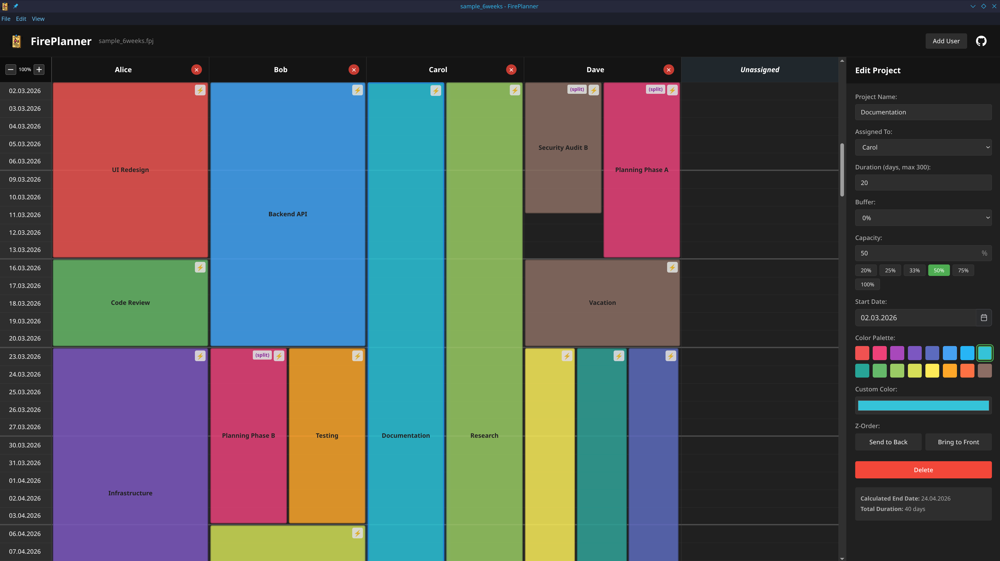
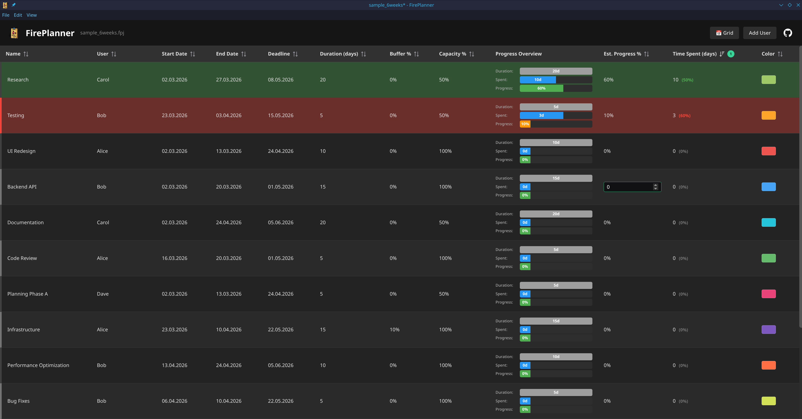

# FirePlanner

A visual project planning desktop application that helps teams organize and track projects across user timelines. Built with Electron, Vite, and Vue 3 + TypeScript.

FirePlanner displays projects as colored blocks in a grid where each column represents a team member and each row represents a weekday. This makes it easy to see who's working on what and when projects overlap.



## Quick Start

After cloning the repository:

```bash
# Install dependencies
npm install

# Start the application in development mode (Windows, Linux, macOS)
npm run dev:electron
```

The application will launch with DevTools open. Your planning data is automatically saved in your system's user data directory.

## Configuration

FirePlanner can be configured by editing the `config.json` file located in your user data directory:

- **Linux**: `~/.config/fireplanner/config.json`
- **Windows**: `%APPDATA%\fireplanner\config.json`
- **macOS**: `~/Library/Application Support/fireplanner/config.json`

The bundled `config.json` in the project root serves as the default configuration. User-specific settings override these defaults.

### Configuration Options

```json
{
  "locale": "de-DE",
  "autosave": {
    "enabled": true,
    "intervalSeconds": 30,
    "folder": ""
  },
  "workingDays": [1, 2, 3, 4, 5],
  "customProperties": []
}
```

#### Locale Settings

- **`locale`** (string): Controls date and number formatting throughout the application
  - Default: `"de-DE"` (German format)
  - Common values:
    - `"en-US"` — US English (dates: 02/18/2026, numbers: 1,234.56)
    - `"en-GB"` — British English (dates: 18/02/2026, numbers: 1,234.56)
    - `"de-DE"` — German (dates: 18.02.2026, numbers: 1.234,56)
    - `"fr-FR"` — French (dates: 18/02/2026, numbers: 1 234,56)
    - `"es-ES"` — Spanish (dates: 18/02/2026, numbers: 1.234,56)
    - `"ja-JP"` — Japanese (dates: 2026/02/18, numbers: 1,234.56)
  - Uses standard [IETF BCP 47 language tags](https://en.wikipedia.org/wiki/IETF_language_tag)
  - Affects: date pickers, date displays, and number formatting throughout the UI
  - **Requires application restart** to take effect

#### Autosave Settings

- **`enabled`** (boolean): Enable/disable automatic saving. Default: `true`
- **`intervalSeconds`** (number): How often to autosave (in seconds). Default: `30`
- **`folder`** (string): Custom autosave directory path. Leave empty (`""`) to use default location in user data directory

#### Working Days

- **`workingDays`** (array of numbers): Days of the week to display in the grid
  - `1` = Monday, `2` = Tuesday, `3` = Wednesday, `4` = Thursday, `5` = Friday, `6` = Saturday, `7` = Sunday
  - Default: `[1, 2, 3, 4, 5]` (Monday-Friday)
  - Example for 6-day week: `[1, 2, 3, 4, 5, 6]`
  - Example for 7-day week: `[1, 2, 3, 4, 5, 6, 7]`

#### Custom Properties

Define additional metadata fields for your projects. Each property definition has:

- **`name`** (string): Display name of the property
- **`type`** (string): Data type - `"string"`, `"number"`, `"float"`, `"boolean"`, `"Date"`, or `"enum"`
- **`required`** (boolean): Whether the field must be filled when creating projects
- **`values`** (object, for enum type only): Maps display names to numeric values

**Supported Types:**

| Type | Description | Example Values |
|------|-------------|----------------|
| `string` | Text input | "ABC-123", "Internal", "Q1 2026" |
| `number` | Integer input | 1, 42, 999 |
| `float` | Decimal input | 2.5, 99.95, 0.333 |
| `boolean` | Checkbox (Yes/No) | true, false |
| `Date` | Date picker (locale-aware) | 2026-02-18 |
| `enum` | Dropdown with predefined options | See below |

**Enum Properties:**

Enum properties provide a dropdown menu with predefined options. Each option has:
- A **display name** (shown to users)
- A **numeric value** (stored in the project file)

This allows you to rename options in the UI without breaking existing data.

**Example Configuration:**
```json
{
  "customProperties": [
    {
      "name": "OrderNumber",
      "type": "string",
      "required": true
    },
    {
      "name": "Priority",
      "type": "number",
      "required": false
    },
    {
      "name": "KIP Factor",
      "type": "float",
      "required": false
    },
    {
      "name": "IsUrgent",
      "type": "boolean",
      "required": false
    },
    {
      "name": "Deadline",
      "type": "Date",
      "required": false
    },
    {
      "name": "Billing Mode",
      "type": "enum",
      "values": {
        "Time & Material": 1,
        "Fixed Price": 2,
        "Retainer": 3
      },
      "required": false
    },
    {
      "name": "Status",
      "type": "enum",
      "values": {
        "Planning": 1,
        "In Progress": 2,
        "On Hold": 3,
        "Completed": 4
      },
      "required": true
    }
  ]
}
```

**Enum Best Practices:**
- Use descriptive display names (e.g., "Time & Material" instead of "TM")
- Assign sequential numeric values starting from 1
- Never reuse numeric values for different options
- To rename an option: change the display name but keep the same numeric value
- To add a new option: use a new numeric value
- Don't delete options that existing projects might use

Custom properties appear in the project editor panel and are also shown in the table view for bulk editing.

**Note:** After modifying `config.json`:
- **Locale changes**: Restart the application for date/number formats to update
- **Custom property changes**: Use File → New to reload config (or restart the application)
- **Working days changes**: Will take effect on next file open or when creating a new plan

### Sample Project

A sample project file (`sample_6weeks.fpj`) is included that demonstrates:
- Four users with various project assignments
- Project lanes (parallel projects with different capacities)
- Split projects (collaborative and sequential)
- Different durations, buffers, and capacity settings
- 6-week timeline spanning March-April 2026

Open it via **File → Open** to explore all features.

## Features

- **Visual Timeline Grid**: Users as columns, weekdays as rows (configurable working days)
- **Locale Support**: Full internationalization with locale-specific date and number formats
- **Project Lanes**: Multiple parallel projects per user with automatic lane assignment based on capacity
- **Split Projects**: Divide projects across team members or time periods with synchronized properties
- **Capacity Management**: Set project capacity (25%, 33%, 50%, 75%, 100%) to show partial availability
- **Buffer & Duration**: Add time buffers and set working day durations with half-day precision
- **Color-Coded Projects**: Assign custom colors to projects for easy identification
- **Quick Editing**: Double-click projects or grid cells to create/edit
- **User Management**: Add, rename, and remove team members
- **Copy/Paste**: Duplicate projects with Ctrl+C, Ctrl+X, Ctrl+V
- **Zoom Controls**: Scale the grid from 50% to 250% (Ctrl +/-)
- **Z-Order Management**: Control visual stacking of overlapping projects
- **Undo/Redo**: Full history support for all changes
- **File Management**: Save, Save As, Open, and Recent Files support
- **Custom Properties**: Define additional metadata fields including enums, dates, and booleans
- **Auto-Save**: Changes are automatically persisted to disk
- **Dark Mode**: Toggle between light and dark themes (Ctrl+D)

## Development

```bash
# Install dependencies
npm install

# Start the Electron app (cross-platform)
npm run dev:electron

# Or on Linux/macOS with auto-cleanup of stale Vite processes
npm run electron:dev
```

Both Vite and Electron run together. Changes to Vue components will hot-reload automatically.

## Testing

Run the comprehensive test suite:

```bash
# Run tests in watch mode
npm test

# Run tests once
npm run test:run

# Run tests with UI
npm run test:ui

# Run tests with coverage report
npm run test:coverage
```

**Test Coverage:**
- Comprehensive test suite covering utilities, stores, and components
- Date utilities (weekday calculations, working day filtering, formatting)
- Project utilities (duration calculation with buffer/capacity, project lane assignment)
- Pinia store (CRUD operations, user management, split projects, undo/redo)
- Vue components (rendering, interactions, drag & drop, project blocks)

## Usage

### Managing Users
- **Add User**: Click the "Add User" button in the header
- **Rename User**: Double-click a user column header
- **Delete User**: Click the × button on a user column (projects move to "Unassigned")

### Managing Projects
- **Create**: Click "New Project" button or double-click any grid cell
- **Edit**: Double-click any project block
- **Delete**: Select a project and press Delete or Backspace
- **Copy/Cut/Paste**: Use Ctrl+C, Ctrl+X, Ctrl+V to duplicate projects
- **Split Project**: Click the ⚡ button on a project to divide it across users or time periods
- **z-Order**: Use "Send to Back" / "Bring to Front" buttons to control overlapping project stacking

### Table View
FirePlanner includes a powerful table view for bulk editing and data analysis. Toggle between grid and table views using the **"Toggle View"** button in the header.



**Table View Features:**
- **Inline Editing**: Click any cell to edit project properties directly in the table
- **Sortable Columns**: Click column headers to sort by any field (name, user, dates, duration, etc.)
- **Multi-Column Sort**: Hold Shift and click multiple headers for complex sorting
- **Resizable Columns**: Drag column borders to adjust widths
- **Custom Properties**: All configured custom properties appear as editable columns
- **Visual Status Indicators**: Row colors indicate project health:
  - **Red**: Critical (time spent exceeds duration or far behind schedule)
  - **Orange**: Warning (behind schedule)
  - **Green**: Ahead of schedule
- **Progress Visualization**: Bar charts show duration, time spent, and estimated progress
- **Quick Navigation**: Click any row to select and view that project in the editor panel
- **Horizontal Scrolling**: Automatically appears when you have many custom properties

The table view is especially useful for:
- Reviewing project timelines at a glance
- Bulk editing dates, durations, and properties across multiple projects
- Identifying overdue or at-risk projects quickly
- Analyzing project metrics and progress tracking
- Exporting data for reports (via selection and copy)

### Project Properties
- **Duration**: Set project duration in working days (supports 0.5 increments)
- **Buffer**: Add time buffer (0-100%) to account for uncertainty
- **Capacity**: Set daily capacity (e.g., 50% for half-time, 33% for three parallel projects)
- **Custom Properties**: Additional metadata fields (configurable in config.json)

### Split Projects
When you split a project:
- Shared properties sync across all splits: name, color, custom properties
- Independent per split: user assignment, start date, duration, buffer, capacity
- Purple border highlights all related splits when one is selected
- Duration summary shows if splits don't match the planned overall duration

### Keyboard Shortcuts
- `Ctrl + N` — New plan
- `Ctrl + O` — Open file
- `Ctrl + S` — Save
- `Ctrl + Shift + S` — Save As
- `Ctrl + C` — Copy selected project
- `Ctrl + X` — Cut selected project  
- `Ctrl + V` — Paste project
- `Delete` / `Backspace` — Delete selected project
- `Ctrl + +` — Zoom in
- `Ctrl + -` — Zoom out
- `Ctrl + 0` — Reset zoom
- `Ctrl + Z` — Undo
- `Ctrl + Y` — Redo
- `Ctrl + D` — Toggle dark mode

## Tech Stack

- **[Electron](https://www.electronjs.org/)** — Desktop application framework
- **[Vue 3](https://vuejs.org/)** — Progressive JavaScript framework with Composition API
- **[Vite](https://vitejs.dev/)** — Fast build tool and dev server
- **[TypeScript](https://www.typescriptlang.org/)** — Type-safe JavaScript
- **[Pinia](https://pinia.vuejs.org/)** — State management with undo/redo support
- **[PrimeVue](https://primevue.org/)** — UI component library
- **[Vitest](https://vitest.dev/)** — Unit testing framework
- **[Vue Test Utils](https://test-utils.vuejs.org/)** — Vue component testing

## Building for Production

```bash
# Build the application for your current platform
npm run build

# Or build for specific platforms
npm run build:linux    # Build Linux AppImage
npm run build:win      # Build Windows installer (NSIS)
```

Distributables will be created in the `release/` directory:
- **Linux**: AppImage (FirePlanner-x.x.x.AppImage)
- **Windows**: NSIS installer (FirePlanner-Setup-x.x.x.exe)
- **macOS**: DMG (requires macOS to build)

### Automated Releases

The project includes a GitHub Actions workflow that automatically builds Linux and Windows releases when you push a version tag:

```bash
# Create and push a version tag
git tag v0.3.0
git push origin v0.3.0
```

The workflow will:
1. Build Linux AppImage on Ubuntu
2. Build Windows installer on Windows
3. Create a GitHub release with both artifacts attached

You can also manually trigger the build from the Actions tab in GitHub.

## License

MIT
